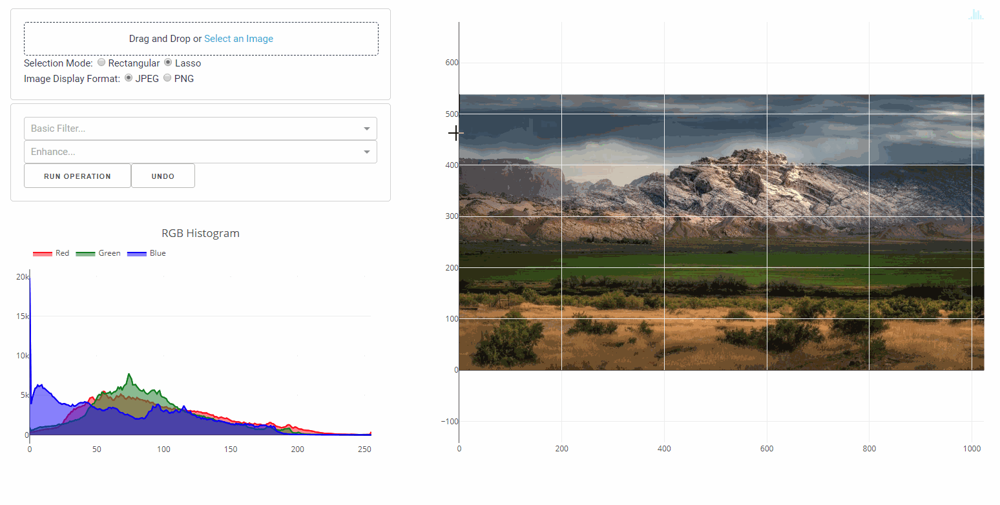
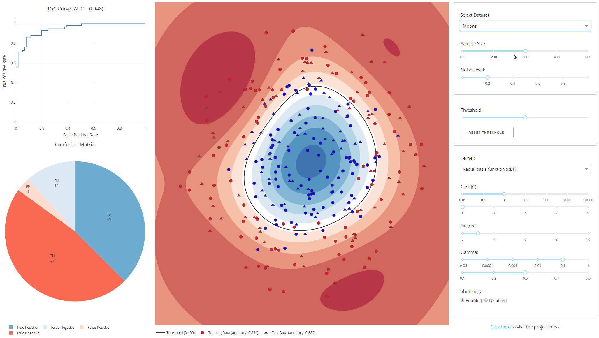
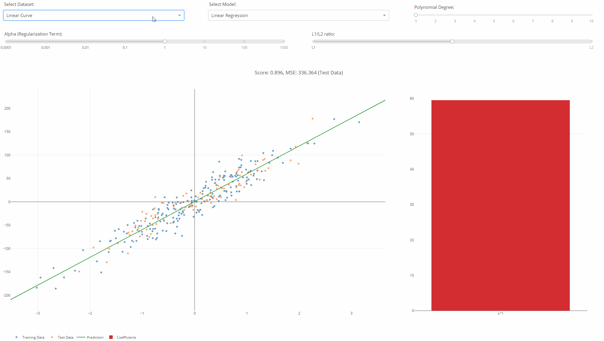

# Dash Projects
You can find below the list of the Dash Apps and Components I created.

## Apps
**t-SNE Explorer**:
[Link to Repo](https://github.com/plotly/dash-tsne) | [Demo App](https://dash-tsne.plot.ly/)

**SVM Explorer**:
[Link to Repo](https://github.com/plotly/dash-svm) | [Demo App](http://dash-svm.herokuapp.com/)

**Image Processing App**:
[Link to Repo](https://github.com/plotly/dash-image-processing) | [Demo App](http://dash-image-processing.herokuapp.com/)

**Live Model Training Viewer**:
[Link to Repo](https://github.com/plotly/dash-live-model-training) | [Demo App](https://dash-live-model-training.plot.ly/)

**Object Detection App**:
[Link to Repo](https://github.com/plotly/dash-object-detection) | [Demo App](https://dash-object-detection.plot.ly/)

**Regression Explorer**:
[Link to Repo](https://github.com/plotly/dash-regression) | [Demo App](https://dash-regression.herokuapp.com/)

## Components
[**Dash Player**](https://github.com/xhlulu/dash-player) - Dash Player is a dash component for playing a variety of URLs, including file paths, YouTube, Facebook, Twitch, SoundCloud, Streamable, Vimeo, Wistia, Mixcloud, and DailyMotion. It is wrapped around the react-player component.

[**Dash Webcam**](https://github.com/xhlulu/dash-webcam) - Dash Component wrapping React-Webcam

[**Dash Katex**](https://github.com/xhlulu/dash-katex) - Katex.js in Python using Dash

[**Dash Draggable**](https://github.com/xhlulu/dash-draggable) - react-draggable in Python

[**Dash Pivottable**](https://github.com/xhlulu/dash_pivottable) - react-pivottable in Python

## Screenshots
### t-SNE Explorer

### Live Model Training Viewer

### Object Detection App

### Image Processing App

### SVM Explorer

### Regression Explorer

